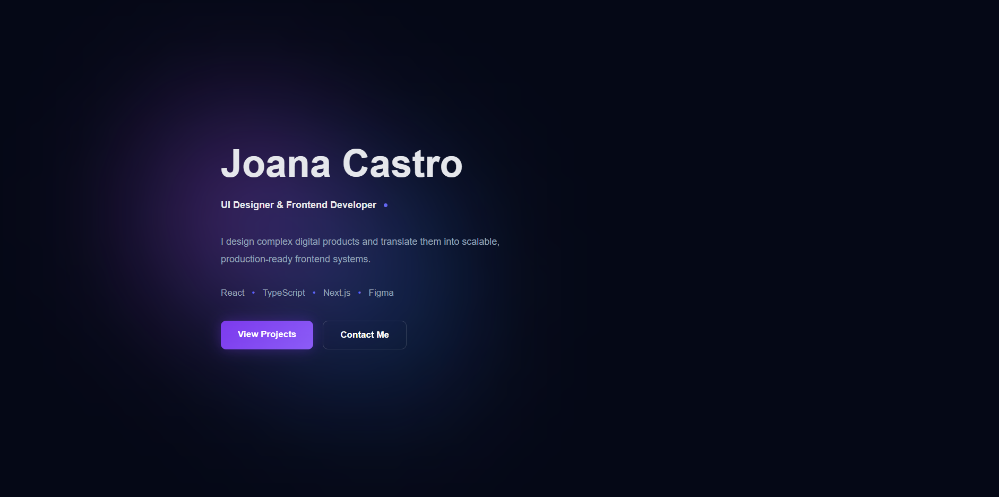
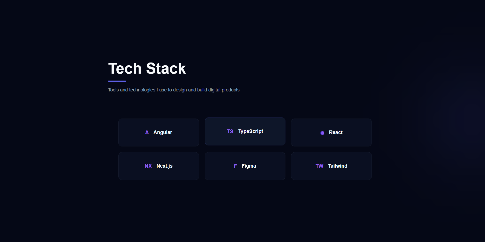
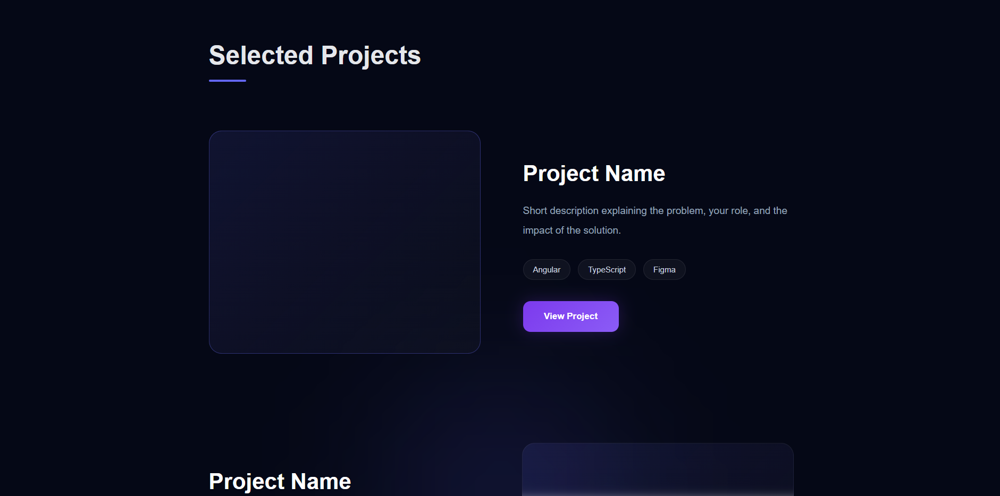
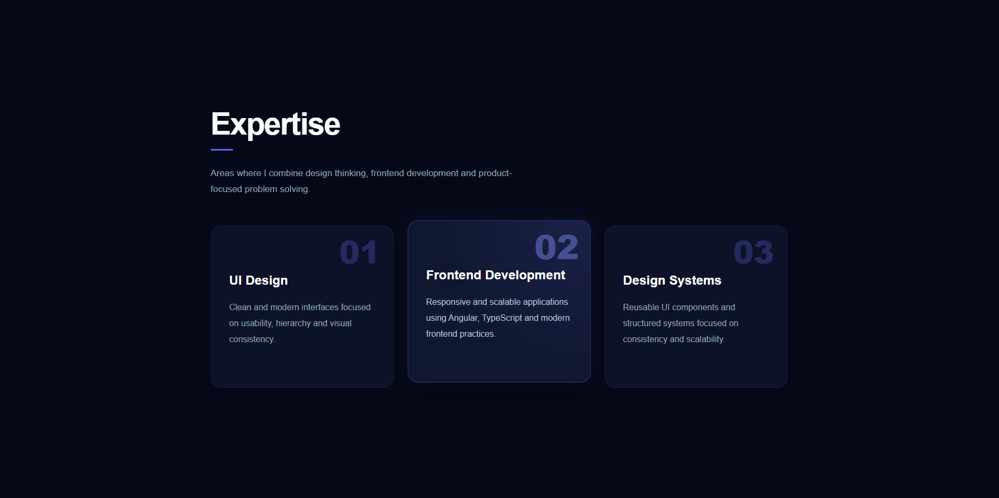

# Portfolio UI Designer & Frontend Developer

Modern and responsive frontend portfolio built with Angular, showcasing UI/UX design, frontend development skills, and creative digital experiences.

---

##  Features

- Modern UI Design
- Fully Responsive Layout
- Angular Architecture
- Component-Based Structure
- Interactive UI Elements
- Dark Premium Theme
- Reusable Components
- Responsive Sections
- Clean Visual Hierarchy

---

##  Technologies Used

- Angular
- TypeScript
- HTML5
- CSS3
- Responsive Design
- UI/UX Design
- Figma

---

##  Project Preview

### Hero Section



---

### Tech Stack



---

### Selected Projects



---

### Expertise Section



---

##  Installation

Clone the repository:

```bash
git clone https://github.com/joanadecastro/PortfolioUidesignerFrontend-Angular.git
